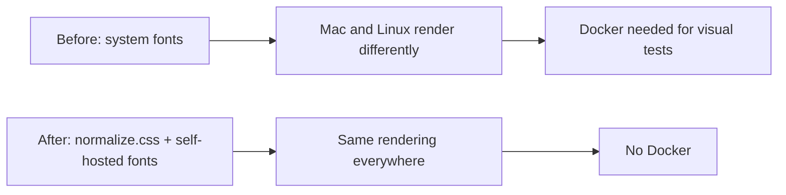

```mermaid
flowchart LR
  A[Before: system fonts] --> B[Mac and Linux render differently] --> C[Docker needed for visual tests]
  D[After: normalize.css + self-hosted fonts] --> E[Same rendering everywhere] --> F[No Docker]
```

check:css output:
```
$ pnpm run check:css
check:css ok
```
